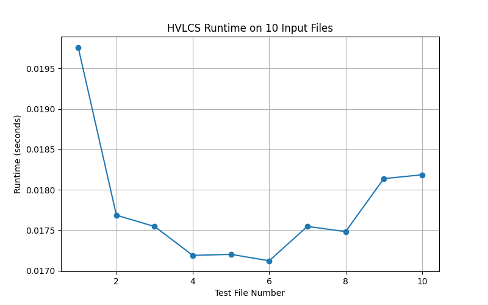

# COP4533–Highest-Value-Longest-Common-Subsequence

This repository contains the implementation for a COP4533 dynamic programming programming assignment. The project solves the Highest Value Longest Common Subsequence (HVLCS) problem by computing the maximum total value of a common subsequence of two strings and reconstructing one optimal subsequence.

## Team Members
- Name: Yuyang Sun, UFID: 38133550  
- Name: Junhao Li, UFID: 51521823

## Requirements / Dependencies
- Python **3.x**
- No external libraries are required.

## Project Structure
- `hvlcs.py` : Main program file containing:
  - input parsing
  - dynamic programming table construction
  - subsequence reconstruction
  - output writing

- `inputs/` : Example input files for testing the HVLCS solver
  - `example.in` : Sample HVLCS input file

- `outputs/` : Generated program outputs
  - `example.out` : Output produced for `example.in`

- `README.md` : Project documentation and usage instructions.

## Input Format

The program reads an HVLCS input file describing the alphabet values and two input strings.

The input file format is:

1. First line: one integer `K`
   - `K` : number of characters in the alphabet

2. Next `K` lines:
   - each line contains one character and its assigned value

3. Next line:
   - string `A`

4. Next line:
   - string `B`

### Example Input

    3
    a 2
    b 4
    c 5
    aacb
    caab

This means:
- `a` has value `2`
- `b` has value `4`
- `c` has value `5`
- the two input strings are `A = aacb` and `B = caab`

## Output Format

The program writes the result to an output file and also prints it to the terminal.

The output contains:

1. First line:
   - the maximum value of a common subsequence

2. Second line:
   - one optimal common subsequence achieving that value

### Example Output

    9
    cb

Explanation:
- `cb` is a common subsequence of both strings
- `Val(cb) = 5 + 4 = 9`

## How to Run

The program is executed from the repository root directory and requires one command-line argument:

    python hvlcs.py <input_file>

Where:

- `<input_file>` : path to the HVLCS input file

### Step-by-step Instructions

1. Open a terminal.
2. Navigate to the project root directory.
3. Run the program using Python with an input file.

### Example

Suppose the repository contains the following file:

    inputs/example.in

Run the program using:

    python hvlcs.py inputs/example.in

The program will:
- print the result to the terminal
- write the result to:

    outputs/example.out

### Generate Additional Test Files

To generate 10 nontrivial input files for runtime testing, run:

    python3 generate_tests.py

This will create:
- inputs/test1.in
- inputs/test2.in
- ...
- inputs/test10.in

### Run Runtime Experiment

To measure runtime on the 10 generated test files and create a graph, run:

    python3 runtime_test.py

This will save the runtime graph as:

    outputs/runtime_graph.png

## Written Component

### Question 1: Empirical Comparison

we created 10 nontrivial input files where each file contains two strings of length at least 25. 
We ran our HVLCS program on each input and measured the total runtime.

The runtime graph is shown below:

The runtime graph shows that the program runs efficiently on all 10 input files. 
The measured runtimes stay within a small range of about 0.017 to 0.020 seconds.

Although the runtime does not increase perfectly from left to right, this is expected for relatively small test cases. 
Overall, the graph is still consistent with our algorithm. As the input sizes increase, the runtime also increases.

### Question 2:

### Question 3: Big-O Analysis

Let `n = len(A)` and `m = len(B)`, where `A` and `B` are the two strings.

#### Time Complexity

The input and output parts only take linear time, so they are not then main cost of the algorithm.

The main part is the function `compute_dp`. It builds a DP table of size `(n+1) x (m+1)`. The algorithm uses two neasted loops:
- the outer loop runs `n` times
- the inner loop runs `m` times

So it fills about `nm` table entries. For each entry, it only does constant work: comparing two characters, looking up previous DP values, and taking a maximum. Therefore, filling the DP table takes: `O(nm)`

After that, the function `reconstruct` backtracks through the DP table to recover one optimal subsequence. In each step, it moves up, left, or diagonally, so the total number of steps is at most `n + m`. Thus, reconstruction takes: `O(n + m)`

So the total running time is: `O(nm) + O(n + m)`

which is dominated by: `O(nm)`

#### Space Complexity

The main space usage also comes from the DP table. Since the table has `(n+1) x (m+1)` entries, it takes: `O(nm)` space.

The input strings and the dictionary of character values use extra space, but these are much smaller than the DP table. The reconstructed subsequence also only uses at most `O(min(n, m))` space.

So the total space complexity is dominated by the DP table, which is: `O(nm)`

#### Final Answer

- **Time Complexity:** `O(nm)`
- **Space Complexity:** `O(nm)`
